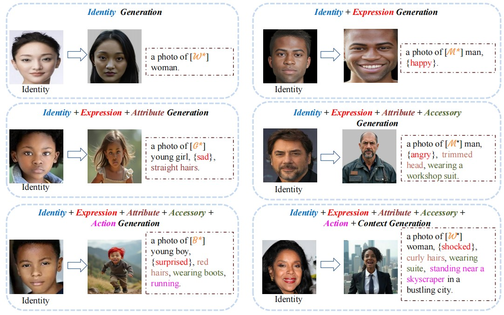
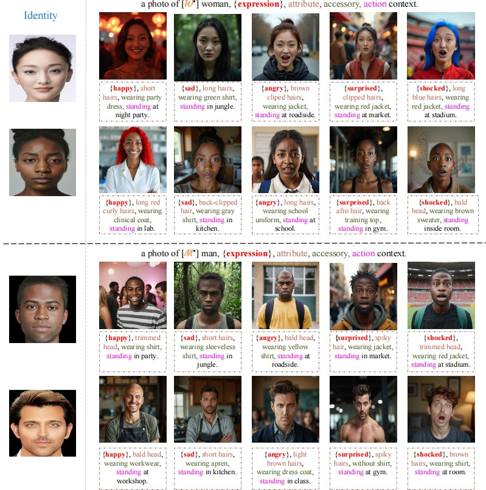

# FaceExpr: Personalized Facial Expression Generation via Attention-Focused U-Net Feature Fusion in Diffusion Models

**FaceExpr** is a framework for generating high-quality facial images with diverse expressions, using standalone text-to-image diffusion models. The framework preserves facial identity while enabling expressive modifications, making it ideal for personalized avatars, virtual environments, and advanced research applications.

## Abstract

Text-to-image diffusion models have revolutionized image generation by creating high-quality visuals from text descriptions. Despite their potential for personalized text-to-image applications, existing standalone methods have struggled to provide effective semantic modifications, while approaches relying on external embeddings are computationally complex and often compromise identity and fidelity. To overcome these challenges, we propose **FaceExpr**, a framework using standalone text-to-image models that provide accurate facial semantic modifications and synthesize facial images with diverse expressions, all while preserving the subject’s identity. Specifically, we introduce a person-specific fine-tuning approach with two key components:

1. **Attention-Focused Fusion**, which uses an attention mechanism to align identity and expression features by focusing on critical facial landmarks, preserving the subject’s identity.
2. **Expression Text Embeddings**, integrated into the U-Net denoising module to resolve language ambiguities and enhance expression accuracy.

Additionally, an expression crafting loss is employed to strengthen the alignment between identity and expression. Furthermore, by leveraging the semantic prior embedded with prior preservation loss, we enable the synthesis of expressive faces in diverse scenes, views, and conditions. Extensive experiments show that FaceExpr outperforms both standalone and hybrid methods in accuracy, efficiency, and overall performance. These results demonstrate its significant potential for personalized content generation in digital storytelling, immersive virtual environments, and advanced research applications.

## Key Features

- **Person-Specific Fine-Tuning**: Fine-tune the model on individual subjects to generate facial expressions while maintaining the subject's unique identity.
- **Attention-Focused Fusion**: Align facial identity and expression features with an attention mechanism, ensuring precise identity preservation.
- **Expression Text Embeddings**: Integrate text-based embeddings into the denoising module to resolve language ambiguities and improve expression accuracy.
- **Semantic Prior Preservation**: Leverage prior preservation loss to synthesize expressive faces in various environments, lighting conditions, and viewing angles.
- **Efficient and Flexible**: Optimized for real-time content generation, digital storytelling, and virtual environments.

## Installation

To use **FaceExpr**, clone the repository and install the required dependencies.

### 1. Clone the Repository
```bash
git clone https://github.com/MSAfganUSTC/FaceExpr.git
cd FaceExpr
```

### 2. Install Dependencies
Make sure you have **Python 3.x** installed. Then, install the required libraries:

```bash
pip install -r requirements.txt
```

The dependencies include PyTorch, Hugging Face Transformers, and other necessary packages.

## Usage
### 1. Generating Expressions

To generate facial images for feature extraction and expression Guidence, use the following command:

```bash
python Expression_Feature_Extraction_Network.py --model <path_to_trained_model> --expression <desired_expression> --output_dir <output_images>
```
### 2. Fine-Tuning the Model

Fine-tune the model for person-specific facial expression generation by following the steps below. You'll need to have images of the person you'd like to train on.

```bash
!accelerate launch train_FaceExpr_afgan.py \
  --pretrained_model_name_or_path="$MODEL_NAME" \
  --pretrained_vae_model_name_or_path="/home/afgan/stable_diffusion_weights/madebyollinsdxl-vae-fp16-fix" \
  --dataset_name="$DATA_DIR" \
  --output_dir="$OUTPUT_DIR" \
  --mixed_precision="fp16" \
  --instance_prompt="a photo of e_w4 woman" \
  --resolution=512 \
  --train_batch_size=1 \
  --gradient_accumulation_steps=3 \
  --gradient_checkpointing \
  --learning_rate=1e-4 \
  --snr_gamma=5.0 \
  --lr_scheduler="constant" \
  --lr_warmup_steps=0 \
  --use_8bit_adam \
  --max_train_steps=400 \
  --seed=0
```

### 2. Generating Expressions

To generate facial images with diverse expressions, use the following command:

```bash
python generate.py --model <path_to_trained_model> --expression <desired_expression> --output_dir <output_images>
```

The model can generate various expressions like happiness, sadness, anger, etc., while keeping the identity intact.

### 3. Example
Here’s an example of generating an image with the "happy" expression for a specific subject:

```bash
prompt = "A front photo of e_w4 woma, happy, wearing blue glasse."
image = pipe(prompt=prompt, num_inference_steps=20).images[0]
image
```
Output

## Results

FaceExpr generates high-quality images with diverse facial expressions while preserving identity. Below are some example outputs:

- **Expression Accuracy**: The generated faces maintain high identity preservation even across multiple expressions.
- **Environmental Diversity**: The model can generate expressive faces in different scenes, such as various lighting conditions and environmental settings.

### Example Output


## Applications

- **Personalized Content Generation**: Generate unique avatars for digital storytelling, virtual reality, and interactive environments.
- **Research Applications**: Useful for creating synthetic facial datasets for emotion recognition, human-computer interaction (HCI), and generative modeling.
- **Entertainment**: Ideal for gaming and film industries to create lifelike characters with realistic emotional expressions.

## Contributing

We welcome contributions to the **FaceExpr** project! Please follow these steps to get started:

1. Fork the repository.
2. Clone your fork to your local machine.
3. Create a new branch for your feature or bug fix.
4. Commit your changes and push them to your fork.
5. Submit a pull request.

## License

This project is licensed under the MIT License. See the [LICENSE](LICENSE) file for more details.

## Acknowledgments

- **Diffusion Models**: We used diffusion-based image generation techniques for creating high-quality images.
- **Open Source Tools**: The project leverages various open-source libraries such as PyTorch, Hugging Face Transformers, and others.

For more details and the code, visit the [GitHub repository](https://github.com/PHFICML2024/FaceExpr.git).
